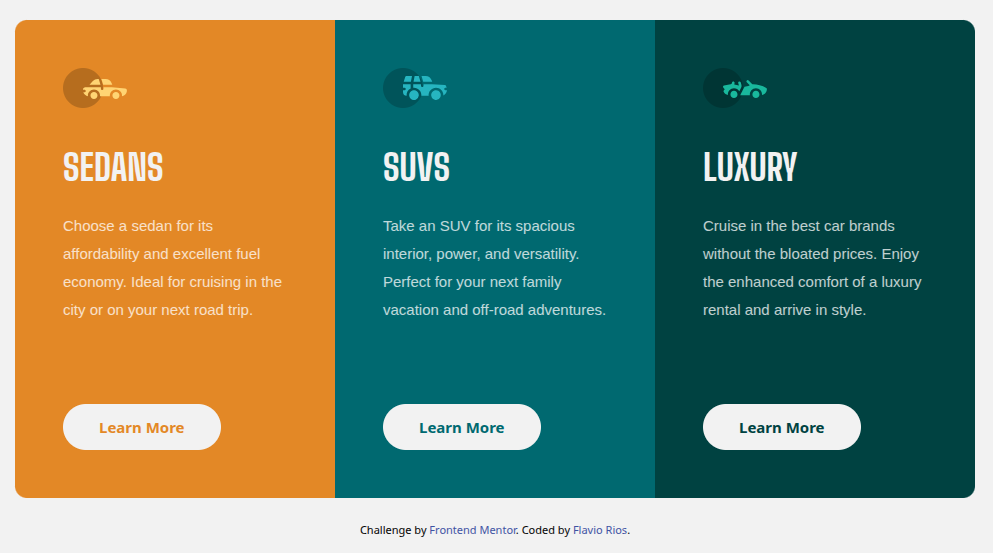

# 3-Column Preview Card Component

## 📋 Overview

### 🧩 The challenge
The goal of this project was to build a responsive and visually appealing interface using Tailwind CSS. Special attention was given to layout consistency across screen sizes and component reusability.

### 🖼️ Screenshot

### 🔗 Links
- Live Site: [GitHub Pages](https://your-live-site.com)
- Repository: [GitHub](https://github.com/flaviovich/frontendmentor-3-column-preview-card)

---

## 🔧 My process

### 🛠️ Built with
- Tailwind CSS
- HTML5
- Custom Tailwind configurations

### 📚 What I learned
- How to customize Tailwind utility classes for more precise control over design.
- Managing responsive design challenges, especially with rounded corners on large screens — which proved to be a bit tricky.
- Improved understanding of Tailwind’s configuration file and how to extend default themes.

### 🚀 Continued development
Future improvements may include:
- Adding animations or transitions for smoother UI interactions.
- Refactoring components for better scalability.
- Exploring Tailwind plugins for enhanced functionality.

### 🔍 Useful resources
- [Tailwind CSS Documentation](https://tailwindcss.com/docs)
- [Tailwind Play](https://play.tailwindcss.com/)
- [Frontend Mentor](https://www.frontendmentor.io/)
- [CSS Tricks](https://css-tricks.com/)

---

## 👤 Author
GitHub: [@flaviovich](https://github.com/flaviovich)  
Twitter: [@flaviovichDev](https://twitter.com/flaviovichDev)

---

## 🙌 Acknowledgments
- Thanks to the Tailwind CSS community for their amazing tools and support.
- Inspiration from various Frontend Mentor challenges.
- Special shoutout to the docs — couldn’t have done it without them!

